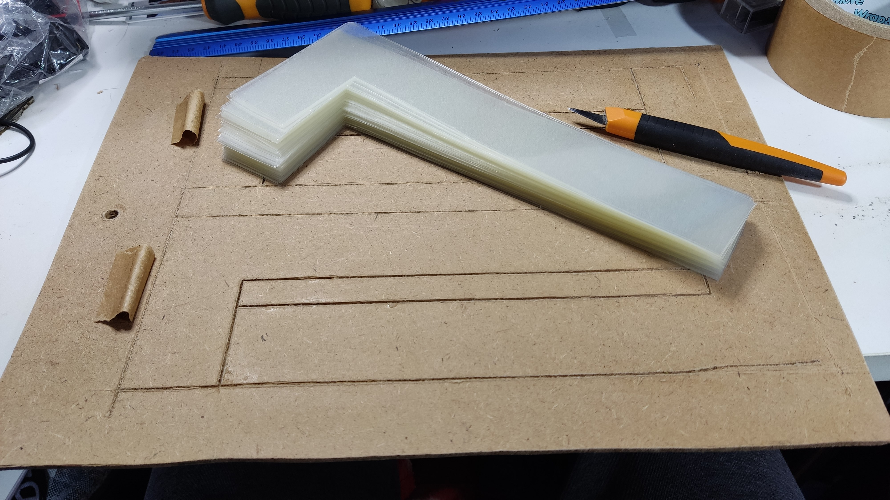

# TheAccordinotreally

~~Repo for the code driving _The Accordinotreally_, a cheap and silly DIY project by BenHasNoBrain. More info to come! (when I get 'round to it :joy:)~~

The Accordinotreally, a 36-key, 48-bass, DIY budget digital accordion by BenHasNoBrain.

It works, but barely.

Disclaimer: This is more a journal than a full build guide, as I only started documenting half-way through the build (facepalms). As such, **a lot of information has not been included.** Some creativity may be required!

# The Ingredients
* 1200x600mm sheet of stiff plastic, for the body panels and structure of the instrument
* 2x 500x190x3mm MDF sheets, for the outer ends of the bellows
* 32x sheets of clear 80 micron plastic laminate
* Raspberry Pi Pico or equivalent, with USB support
* Old PS/2 keyboard
* Old digital piano keyboard
* A LOT of clear cellophane tape, minimum 2 wide rolls
* 2x BMP280 atmospheric pressure sensors
* A lot of patience, a lot of time, and a buncha good music playlists (preferrably accordion-based music, to set the mood!)

# The Why
* I wanted to learn how to play the accordion, in memory of my grandfather whom I never got to hear play before he passed on.
* I didn't want to spend $4000+ AUD to buy a second-hand one, and I didn't want to annoy my household members with a really loud acoustic one!

# The How
Lots of steps. Long process. Lots of things learnt along the way.

## The Bellows
Building the bellows was the longest, most arduous, and stickiest part of the whole build, which is why I started on them first.

I wanted a thin, yet stiff material that would have some flex but not be permeable. It also had to be cheap, easy to work with, and readily accessible. The answer: **plastic laminating sheets**!

1. Run all the laminating sheets, empty, through a laminating machine.
2. Decide on the length and width of your accordion bellows, and the thickness of the bellows ribs. In my case, my bellows were 500x190mm, and 40mm thick - I was able to cut out 4 sections of each rib per A4 laminate sheet. I also opted for **16 full ribs**, so I needed **32 sheets of laminate**.
* (Optional): Etch out the cutting lines into a sheet of MDF, where you can slap down a laminate, and quickly score out the cutting lines.
3. **128x**: Cut out the bellows rib sections.

4. **32x**: Join 4 bellows rib sections to form one half of a bellows rib, using clear cellophane. Wrap the cellophane around each join to create an airtight and solid seal. 

5. **32x**: Tape the half-ribs together, one at a time, to form a chain of ribs. You will need to alternate between taping the inside and outside edges of the ribs in order to get the concertina foldings.

6. On **one** of the MDF sheets, drill out a bunch of holes. This will be used to let air in and out of the bellows. Leave the other MDF sheet intact for now.
7. Carefully tape the bellows ribs to the drilled MDF side. Make sure that the join is as airtight as possible.

8. Attach one BMP280 sensor to the MDF sheet for the other side, run its wiring through the sheet, and make sure that it is airtight.

## The Keyboard
I used a cheap piano keyboard that used rubber-domed membrane switches (not weighted, and no velocity sensing). I apologise for not taking any pictures of the actual circuitry!

1. Dismantle your keyboard - save the keys and switches, and remove the keyboard daughterboard from the main motherboard. Mine uses **36 keys** because any more would make the accordion too long.
2. In my case, I had to add some supports to the bottom of the keys where it contacted the rubber-domed switches - I broke up some tongue depressors and hot-glued them to the stems to provide a larger surface area.

3. Screw the keyboard to a strip of thick MDF, to fix them in place.
4. Attach _that_ MDF strip to a sheet of plastic that is the same dimensions as the keys - I had this factored in when I CAD'd up the Accordinotreally shell, so I attached the keys + MDF combo directly to the body.
5. Attach the switch daughterboard in its respective place, directly underneath the keys. Make sure that the ribbon cable (or what have you) that dictates the keyboard matrix is still accessible.

## The Bass
I had a full-size, "waterproof", cheap, and OLD PS/2 keyboard lying around at home, so I decided to use that for the bass keys. It was a lucky coincidence that I could only use PS/2 for the microcontroller - PS/2 is interrupt-based, and when a key is pressed it sends an 11-bit package that can be read by a serial port, or in this case any of the digital pins on the microcontroller.

I snipped off the old connector, exposed the wires (of which there are 4: power, ground, clock, data).

The code for reading the data can be found somewhere in this repo.

## The Body
After a good 3 months of researching accordions and common sizes and bellows sizes and lengths and you get the idea, I had come to the conclusion that there is shockingly little detail on the 'net when it comes to specifics, such as what the angle of the keyboard is relative to the body (it slants towards the player), the length of the bellows when it's fully extended, and so on.

Through reverse-engineering a bunch of images from accordion sellers (pixel measuring and measuring angles), I came up with a blueprint that was very much "build it, and hope it fits well".

More information to come later, once the paper notes have been scanned in.

## The Brains (of the instrument)
I used a Raspberry Pi Pico, because they were the cheapest at the time ($16 AUD through Amazon).

After wiring the piano keyboard matrix (16 wires) to the Pico, I wrote up a quick program to find out the rows/columns of the matrix. Turns out that my particular model was a 8x8 matrix, but the first 3 rows weren't used (they belonged to a second daughterboard in the piano, for the rest of the keys that I had discarded).

As mentioned under _The Bass_, I had to write up a custom interrupt function to register the key presses on the keyboard.

Two BMP280 pressure sensors were also used - one was placed in the body cavity on the piano side to measure the ambient atmospheric pressure (to provide a baseline), and one sensor inside the bellows to measure the strength of the, well, bellowing.

The Pico uses the MIDI.h library to communicate to the DAW (I use LMMS because it's free and can run on 20-year-old potatoes). For the bass, all chords are calculated (actually it uses a manually-written chord lookup table, and then applies note modifications).

## The Everything Else
TODO: Adding a shoulder strap, glueing everything together, the body design + images, possible performance sample?

---

## Changelog
### 12/8/23
* First commit, containing 3 weeks of initial code development (working prototype)
### 13/8/23
* Added new branch for reworking the Bass system, specifically in scanning and MIDI sending
### 21/8/23
* Fixed Bass system hanging (i.e. becoming completely unresponsive, while the rest of the system was fine) via RP2040 settings, see `Accord_Midi: 78`. Modifications to pressure sensing + displaying.
### 28/8/23
* Attempt to fix pressure system: changed MIDI ControlChange from aftertouch to channel volume. Re-added `panik` functionality.
### 4/9/23
* Merged `bass_revamped` and `main` branches. Removed all sampling + filtering from BMP280 sensor, to be calculated in a separate function and enveloped.
* Discovery: To get pressure volume, link the controller in the respective DAW (i.e. link volume knob in LMMS to the MIDI volume channel set by the Accordinotreally)
### 7/9/23
* Added second "external" pressure sensor (i.e. outside of bellows) for better reference for bellows pressure - now the Accordinotreally responds better to changes in atmosphere (temperature etc), rather than relying on a fixed value.

|   Known bugs  |   Description |
|   ---         |   ---         |
| Bass overlapping notes    |   When pressing 3 chords where some of the keys overlap, some of the notes don't release when all of the keys are released.   |

|   Todo    |
|   ---     |
| Stick the OLED somewhere visible on the body  |
| Make a longer USB cable   |
| Make a bellows clip for both sides of the body |
